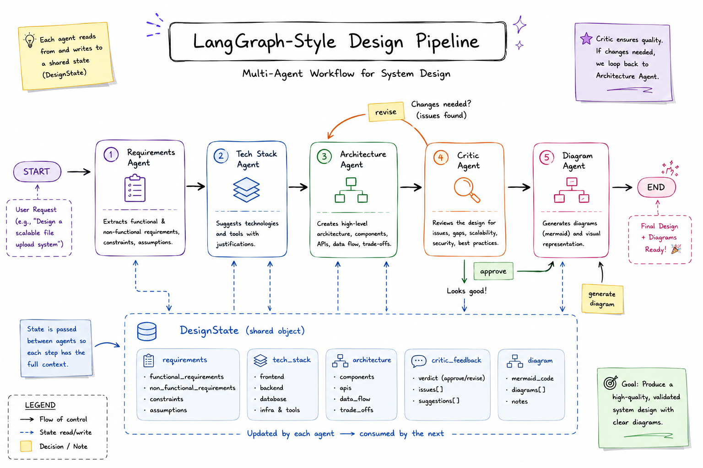
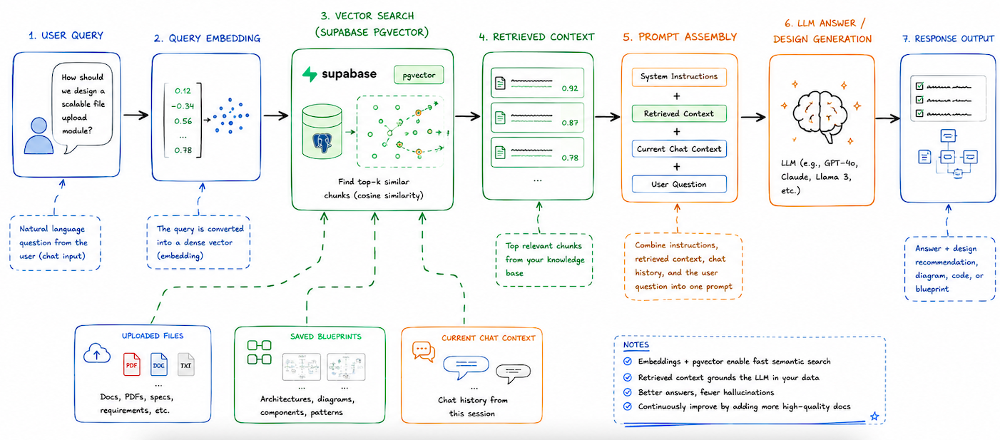
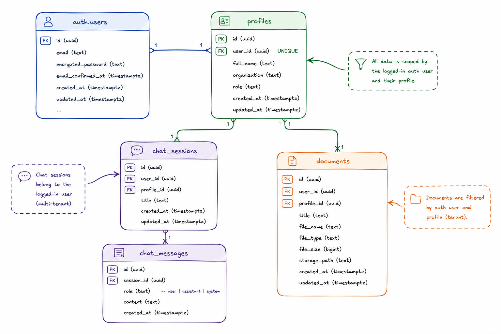

# Blueprint AI

**An agentic AI workspace that turns conversation into system design.**

Blueprint AI is a chat-first product/system design assistant. It behaves like a normal Q&A copilot by default, and only spins up its full multi-agent design pipeline — requirements, tech stack, architecture, diagramming, and critique — when the user explicitly asks it to generate a design. Every session, upload, and generated blueprint is saved per-user behind auth, so people can leave and come back to exactly where they left off.

<p align="center">
  
  
  
  
  
</p>

---

## Table of Contents

- [Project Scope](#project-scope)
- [Architecture](#architecture)
- [RAG Pipeline](#rag-pipeline)
- [Core User Features](#core-user-features)
- [AI / Product Capabilities](#ai--product-capabilities)
- [Data Model](#data-model)
- [Retrieval / RAG Details](#retrieval--rag-details)
- [Technical Characteristics](#technical-characteristics)
- [UX Philosophy](#ux-philosophy)
- [Getting Started](#getting-started)
- [Roadmap](#roadmap)

---

## Project Scope

Blueprint AI is built around one core idea: **default to conversation, escalate to design only on request.**

| Mode | Trigger | Behavior |
|---|---|---|
| **Chat (default)** | Any normal message | Direct, answer-only assistant. Clarifies, explains, discusses trade-offs. No pipeline runs. |
| **Design Generation (opt-in)** | A `generate design`-style prompt, or the **Generate Design** button | Fires the full LangGraph pipeline and produces a complete architecture blueprint, including a rendered diagram. |

This makes the app feel like a lightweight assistant most of the time, with a heavyweight design engine available on demand — not a wizard the user is forced through.

Beyond the AI behavior, the app is a **multi-user, auth-gated product**: every user has their own login, their own saved chat sessions, their own uploaded documents, and their own generated blueprint history. Nothing is shared across accounts unless explicitly designed to be.

---

## Architecture
</img>

**High-level flow:**

1. **Streamlit frontend** — renders chat, sidebar config, and the right-side auth/status panel.
2. **Auth layer** — Supabase Auth (email/password) with refresh-token cookie for persistent login.
3. **Session/state layer** — manages the active chat session, current uploaded files, and whether the user is in chat mode or design-generation mode.
4. **LangGraph multi-agent pipeline** — only invoked in design-generation mode. Runs requirements → tech stack → architecture → diagram → critic, with a revision loop.
5. **Supabase persistence** — chat history, uploaded files, and generated blueprints are all written back so they survive a page refresh or a new session.

### Why two Supabase clients?

The backend intentionally separates **identity** from **data access**:

- **Anon-key client** — used strictly for authentication (sign-up, sign-in, session/token handling). Runs with the permissions of the requesting user.
- **Service-role client** — used for data and RAG operations (reading/writing `chat_sessions`, `chat_messages`, `documents`) after the user's identity has already been established. This keeps retrieval and persistence logic decoupled from auth logic, and avoids leaking elevated privileges into the auth flow.

---

## RAG Pipeline

> **📌 Placeholder — insert RAG / retrieval pipeline diagram here.**
</img>

**Retrieval flow:**

1. **Identity-aware filtering** — every retrieval call is scoped to the current `auth.users` ID and `profiles` ID, so one account never sees another account's documents or blueprints.
2. **Semantic search** — vector embeddings over the `documents` table (Supabase/pgvector) power similarity search for grounding.
3. **Keyword fallback** — if the vector search or its underlying RPC call fails for any reason, the system falls back to a keyword-based search so retrieval degrades gracefully instead of failing silently.
4. **Context builder** — merges three sources into a single context window before it reaches the agents:
   - the **current design state** (whatever's been discussed/generated so far in this session)
   - **retrieved documents** from the grounded corpus
   - **actively uploaded files** for the current session
5. **Account-specific grounding** — this is deliberately *not* a global search index. Retrieval is always scoped to the logged-in user's own corpus, not the whole platform's documents.

---

## Core User Features

**Auth & Session**
- Email/password signup and login.
- Persistent login via a refresh-token cookie — no re-login on every visit.
- Logged-in state (user identity, session status) always visible in the UI.
- Logout available from the right-side auth card.

**Chat**
- Default chat interface answers questions directly — clarifications, explanations, iterative discussion, no forced pipeline.
- Full conversation history for the current session is shown in the main chat area.
- Sessions are saved and can be reopened later, exactly as left.

**Design Generation**
- Triggered explicitly, either via a `generate design`-style prompt or a dedicated **Generate Design** button — never automatically.
- Produces a full blueprint: requirements, stack, architecture, and a rendered Mermaid diagram.

**Files & Blueprints**
- Upload files for grounding and reuse as session context.
- View saved attachments for the current account at any time.
- See recently generated blueprints, pulled live from the database, without re-generating them.

---

## AI / Product Capabilities

Blueprint AI operates in two distinct capability modes, and it's important they stay separate in both UX and implementation:

### 1. Answer-only mode (default)
A conversational assistant for clarifying scope, explaining trade-offs, and iterating on ideas *before* anything is generated. This is intentionally lightweight — no pipeline, no multi-step reasoning shown, just a direct answer.

### 2. Full design-generation pipeline (opt-in)
When explicitly invoked, the system runs a structured, multi-step pipeline:

| Step | Purpose |
|---|---|
| **Requirements extraction** | Turns the conversation/prompt into structured functional and non-functional requirements. |
| **Tech stack selection** | Chooses an appropriate stack given the extracted requirements. |
| **Architecture synthesis** | Produces the actual system design based on requirements + stack. |
| **Critic / revision loop** | An independent critic agent reviews the design and requests revisions until it's approved or a max-revision limit is hit. |
| **Mermaid diagram generation** | Renders the finished architecture as a Mermaid diagram directly in the UI. |

**Supporting capabilities:**
- **RAG grounding** — pulls from the user's Supabase-stored document corpus.
- **Session-aware context** — uses currently uploaded files as live context for the current session.
- **History-aware context** — can reference the user's own saved blueprint history when generating or refining a new design.
- **Discuss before generating** — requirements can be discussed and refined conversationally before a design is actually produced.
- **Regenerate on new direction** — the user can redirect ("actually, make it event-driven instead") and get a fresh pass through the pipeline.

---

## Data Model

All persistence lives in Supabase (Postgres). The core tables:

| Table | Purpose |
|---|---|
| `auth.users` | Supabase-managed identity table. |
| `profiles` | Application-level user profile, linked 1:1 to `auth.users`. |
| `chat_sessions` | One row per conversation thread, owned by a user. |
| `chat_messages` | Individual user and assistant messages, linked to a `chat_sessions` row. |
| `documents` | A unified table for **uploaded files**, **generated blueprints**, and the **grounded retrieval corpus** — each row tagged with type and owner metadata. |

Notes:
- "Recent blueprints" shown in the UI are just a filtered, ordered query over `documents` for the logged-in user — not a separate cache or table.
- Every uploaded file is stored with user/profile identity metadata attached, which is what makes per-account filtering possible downstream in retrieval.

---

## Retrieval / RAG Details
- **Semantic search** over the `documents` table using vector embeddings.
- **Identity-aware filtering**: every query is scoped by `auth.users` ID and `profiles` ID — retrieval is never global.
- **Keyword fallback**: if vector search (or its RPC) fails, the system falls back to keyword matching rather than returning nothing.
- **Context builder** merges:
  - current design state,
  - retrieved documents,
  - actively uploaded files,

  into the final context passed to the agent pipeline.
- **Account-specific grounding**: this is a design decision, not an afterthought — the retrieval corpus is always scoped to the account, supporting a private, per-user knowledge base rather than a shared/global index.

---

## Architecture / Pipeline (Implementation Notes)
</img>
- **Frontend**: Streamlit.
- **Orchestration**: LangGraph-based multi-agent pipeline.
- **Agents**: dedicated agents for requirements, tech stack, architecture, diagram generation, and critique — each with a narrow, single responsibility.
- **Revision loop**: the critic agent can send the design back for revision; this repeats until either the critic approves the design or a maximum revision count is reached (to guarantee termination).
- **Diagram rendering**: Mermaid diagrams are rendered directly in the Streamlit UI.
- **Persistence**: finished design results are written back to Supabase (`documents`), making them available in "recent blueprints" and as future RAG context.

---

## Technical Characteristics

- **Language/UI**: Python application with a Streamlit UI.
- **Backend**: Supabase (Postgres, Auth, storage).
- **Retrieval**: Vector embeddings for semantic search over stored documents.
- **Access pattern**: Service-role client for data/RAG operations; anon-key client for auth operations (see [Architecture](#architecture) for why these are split).
- **Session restoration**: Cookie-backed auth restoration — refreshing the page doesn't log the user out.
- **Layout**: Responsive layout with a sidebar for configuration and a right-side panel for auth/status.
- **Persistence**: Chat history and generated artifacts persist across refreshes — nothing lives only in memory.

---

## UX Philosophy

Blueprint AI is intentionally *not* a guided wizard. Specific decisions:

- **No forced yes/no confirmation flow** — the user isn't interrupted with gate-checks before the assistant proceeds.
- **No exposed "thought process"** — intermediate agent reasoning isn't dumped into the chat area; the chat stays clean and messenger-like.
- **Minimal chrome** — the main screen stays focused on the conversation and the resulting output, not on pipeline mechanics.
- **Clear status, not clutter** — loading/status indicators appear while the assistant is answering or generating, so the user always knows something is happening, without verbose logging.

---

## Getting Started

> _Fill in with actual setup steps once finalized — placeholder scaffold below._

```bash
# clone
git clone <repo-url>
cd blueprint-ai

# install dependencies
pip install -r requirements.txt

# configure environment
cp .env.example .env
# fill in SUPABASE_URL, SUPABASE_ANON_KEY, SUPABASE_SERVICE_ROLE_KEY, etc.

# run
streamlit run app.py
```

---

## Roadmap

- [ ] Add architecture diagram (see [Architecture](#architecture) placeholder)
- [ ] Add RAG pipeline diagram (see [RAG Pipeline](#rag-pipeline) placeholder)
- [ ] Expand test coverage for the critic/revision loop
- [ ] Document max-revision configuration
- [ ] Add example `.env.example`

---

<p align="center"><sub>Built as part of an agentic AI engineering effort — Blueprint AI, an Engineering Design Assistant.</sub></p>
